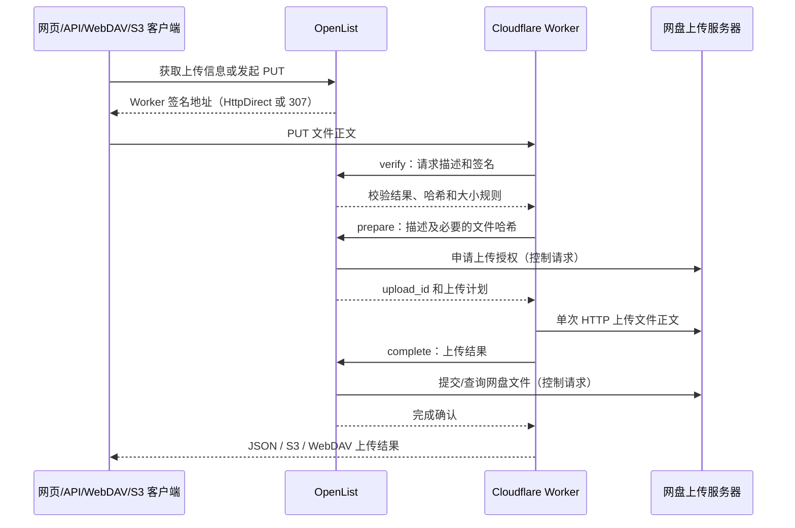

# 外部上传代理

本功能参考 [官方下载代理](https://doc.oplist.org/ecosystem/official_proxy) 的配置方式，由 OpenList 签发客户端上传地址，Cloudflare Worker 执行网盘上传。无需修改 MyOpenList-Frontend，管理后台通过后端设置和驱动字段描述显示配置，网页上传复用现有 `HttpDirect` 工具。

## 数据流程



OpenList 不读取代理入口的上传正文，不通过 `/api/fs/put` 转发文件到网盘。网盘临时上传 URL、Cookie 和请求参数仅下发给 Worker，客户端得到的是 Worker 地址。原有客户端直传机制保持优先；支持直传的驱动继续直接上传。

## 后台配置

先运行包含本功能的后端，再在管理后台的设置中配置以下字段（`SINGLE` 分组，通常显示在“其他”）：

| 设置键 | 默认值 | 含义 |
| --- | --- | --- |
| `upload_proxy_enabled` | `false` | 全局启用外部上传代理 |
| `upload_proxy_expiration` | `900` | 签名开始期限及准备后会话有效期，秒；有效范围 1–86400 |
| `upload_proxy_max_size` | `100` | 单文件上限，MiB；有效范围 1–1024 |
| `upload_proxy_buffer_size` | `32` | 需要预先计算哈希或接收 multipart 表单时的单文件上限，MiB；有效范围 1–32 |

在支持的存储编辑页面配置：

| 驱动字段 | 含义 |
| --- | --- |
| `upload_proxy_url` | Worker 的基础 URL，例如 `https://upload.example.com`；不要添加 `/upload`、查询参数或片段；留空关闭该存储的代理上传 |
| `disable_upload_proxy_sign` | 默认 `false`；启用后允许该存储匿名、免 Token、免签名上传 |

只有实现代理协议的驱动提供这些字段。全局开关开启且存储地址非空时，代理生效。Worker `WORKER_ADDRESS` 必须与该存储地址一致。

### 已适配驱动

| 驱动 | Worker 上传协议 | 哈希要求与限制 |
| --- | --- | --- |
| 蓝奏云 `Lanzou` | 一次 multipart/form-data POST 到 `html5up.php` | 流式上传；仅账号/Cookie 挂载支持上传 |
| 蓝奏云优享 `ILanZou` | 一次七牛 multipart/form-data POST，OpenList 提交结果 | Worker 先计算 MD5；上限为缓冲限制，默认 32 MiB；支持协议秒传 |
| 光鸭 `GuangYaPan` | 一次 OSS PUT，OpenList 查询上传任务 | 不预先计算可选 MD5，可流式上传；OSS 临时授权只给 Worker |
| 移动 `139Yun` 新个人云、新家庭/群组上传 | 申请覆盖整个文件的单个 part，一次 PUT，OpenList complete | Worker 先计算 SHA-256；默认 32 MiB；服务端必须返回单请求授权 |
| 移动 `139Yun` 旧个人云、启用旧上传的家庭/群组 | 一次 POST，range 覆盖整个文件 | 流式上传；不支持空文件；分享挂载不支持上传 |

`FeijiPan` 与 `ILanZou` 共用实现和 Addition，也会显示相同字段。需要账号联调确认其当前上传协议。

所有模式均不拆分文件、不续传。网盘自身限制和 Cloudflare 请求大小/内存/CPU 限制仍适用。蓝奏网盘若返回需要重放正文的反爬挑战，本实现返回失败，不自动重放流式上传。

## Worker 配置与部署

Worker 项目在 `D:\Win\Documents\GitHub\openlist-upload-worker`，具体部署步骤见该项目 `README.md`。使用以下四项配置：

```dotenv
ADDRESS=https://your-openlist-server
TOKEN=your-api-token-here
WORKER_ADDRESS=https://your-worker-address
DISABLE_SIGN=false
```

`TOKEN` 使用 OpenList“设置 → 其他”最下面的长期 Token，Worker 调用控制接口时直接发送 `Authorization: TOKEN`，不添加 `Bearer`。登录 JWT、S3 Access Key 均不能替代此 Token。签名直接使用现有 Token 和 OpenList HMAC 签名实现，没有额外认证密钥。

`DISABLE_SIGN=false` 时，Worker 必须配置 Token，目标存储保持 `disable_upload_proxy_sign=false`。签名、期限、路径、文件名、大小、请求方法、格式、内容类型和存储版本在 OpenList 校验。

`DISABLE_SIGN=true` 时 Worker 不发送 Token，目标存储必须开启 `disable_upload_proxy_sign=true`。任何知道地址的人可以指定已开启匿名代理的存储目标并上传，无需先创建授权任务。此模式仍执行路径、大小、格式及网盘协议检查。切换时同时修改 Worker 和存储，避免模式不一致导致拒绝请求。

## 客户端接入

### 推荐：先获取 HttpDirect 上传地址

使用现有 OpenList 用户认证访问：

```http
POST /api/fs/get_direct_upload_info
Authorization: <OpenList 用户登录凭据>
Content-Type: application/json
Overwrite: true

{"path":"/蓝奏","file_name":"example.txt","file_size":3,"tool":"HttpDirect"}
```

OpenList 检查现有用户、元信息写入权限和目标挂载，返回既有格式：

```json
{
  "code": 200,
  "message": "success",
  "data": {
    "upload_url": "https://upload.example.com/upload?payload=...&sign=...",
    "method": "PUT",
    "chunk_size": 0,
    "headers": {"Content-Type": "application/octet-stream"}
  }
}
```

保持 URL 和返回的请求头，PUT 原始文件到 `upload_url`。不要把 OpenList 用户认证或 Token 作为 Worker 上传必需参数。上传进度由客户端 HTTP 上传进度事件计算；Worker 成功响应表示网盘完成通知已被 OpenList 确认，目录再次刷新即可显示文件。Worker 不向 OpenList 上报逐字节进度。

不要修改签名描述，不要替换 MIME，不要拆分请求。需要重试时重新获取地址，再重新发送整个文件。中断请求可以取消尚在执行的 Worker 上传；已经提交给网盘的文件不保证回滚。

### 既有上传入口

| 入口 | 行为 |
| --- | --- |
| `PUT /api/fs/put` | 用 `File-Path`、`Content-Length`、`Content-Type` 签发地址并返回 307；未知正文长度需 `X-File-Size` |
| `PUT /api/fs/form` | 返回 307；必须提供 `X-File-Size`，其值为文件大小而非整个表单大小；Worker 要求表单只有一个名为 `file` 的文件且文件名匹配 |
| WebDAV `PUT /dav/...` | 现有权限检查后返回 307；Worker 完成返回 201 |
| OpenList 对外 S3 API `PutObject` | 现有 S3 认证通过后返回 307；Worker 完成返回空 200 和文件 MD5 ETag |

客户端负责跟随 307 并保留 PUT 方法和正文，本实现不保证所有 S3/WebDAV SDK 都支持该流程。启用代理的存储拒绝 OpenList multipart 初始化与 S3 multipart 上传；S3 `aws-chunked`、streaming 签名正文和 `CopyObject` 不支持通过该入口上传。S3 `Content-MD5` 与普通 `X-Amz-Content-Sha256` 会绑定到签名描述，并在 Worker 检查。

已有网页选择 `HttpDirect` 即可使用。旧表单上传客户端如果未提供 `X-File-Size`，需改为先获取 HttpDirect 信息。

后端处理器在返回 307 前不读取正文。为避免反向代理预先缓存上传，Nginx 对这些入口应设置 `proxy_request_buffering off`。客户端先获取 HttpDirect 地址可以避免向 OpenList 发送文件正文；对直接 PUT 的客户端，提前发送正文、网络层接收或代理缓存仍可能消耗源站流量。

## Worker 控制接口标准

三个接口均为 POST JSON，只传控制数据，不接受文件正文。请求上限 128 KiB，网盘完成响应正文上限 64 KiB。检查 OpenList JSON 信封的 `code`，不能仅依赖 HTTP 200：成功为 `{"code":200,"message":"success","data":...}`，校验失败一般为 `code:403`。

### 请求描述

客户端 URL 中 `payload` 为 UTF-8 JSON 的无填充 base64url；`sign` 为 OpenList 签发的签名。客户端将 URL 当作不透明地址。Worker 解码并提交以下字段：

| 字段 | 类型 | 含义 |
| --- | --- | --- |
| `path` | string | 完整 OpenList 目录路径，绝对、规范化路径 |
| `file_name` | string | 单段文件名，不得包含目录分隔符 |
| `file_size` | integer | 实际文件字节数，必须已知、非负 |
| `method` | string | 实际客户端请求方法，当前只能为 `PUT` |
| `format` | string | 按实际 Content-Type 区分 `raw` / `form` |
| `content_type` | string | raw 使用实际 MIME；form 使用 `application/octet-stream` |
| `overwrite` | boolean | 是否允许覆盖 |
| `response` | string | `json` / `s3` / `webdav` |
| `worker_address` | string | Worker 配置的基础 URL |
| `storage_id` | integer | OpenList 签发时的存储 ID |
| `storage_time` | integer | 签发时存储更新时间，Unix 毫秒 |
| `sign` | string | URL 中的签名；匿名模式可为空 |
| `hash` | string | prepare 阶段按 verify 要求计算的十六进制 MD5 / SHA-256 |
| `content_md5` | string，可省略 | S3 提交的 base64 MD5 |
| `content_sha256` | string，可省略 | S3 提交的十六进制 SHA-256 |
| `disable_sign` | boolean | Worker 的免认证模式，必须被目标存储允许 |

签名覆盖除 `sign`、`hash` 外的请求描述字段，使用 `upload-proxy-v1:` 域分隔。`hash` 由 Worker 读取正文后计算；签名模式下 prepare 仍需 Token。Token 改变会使旧签名失效；修改存储配置也使旧签名/会话失效。

### `POST /api/upload_proxy/verify`

请求体是上述描述。OpenList 校验所有规则，成功返回：

```json
{"hash":"md5","max_size":104857600,"buffer_max":33554432}
```

`hash` 可以是空字符串、`md5` 或 `sha256`。大小单位为字节。需要哈希时 Worker 在缓冲限制内先读取并计算，文件不会发送给 OpenList。

### `POST /api/upload_proxy/prepare`

提交同一描述，补充必要的 `hash`。OpenList 再次校验，检查覆盖和可写目录，执行网盘上传初始化，返回：

```json
{
  "upload_id":"会话 UUID",
  "plan":{
    "url":"https://provider.example/upload",
    "method":"POST",
    "headers":{"Cookie":"网盘临时会话"},
    "encoding":"multipart",
    "fields":{"token":"网盘上传授权"},
    "file_field":"file",
    "instant":false
  }
}
```

`encoding` 为空或 `raw` 表示直接发送文件字节；`multipart` 表示 Worker 包装为一个 HTTP multipart/form-data 请求，**不是分片上传**。`instant=true` 表示网盘已完成秒传，不再上传到网盘，但 Worker 仍读取客户端正文以确认大小和校验和。不能将 plan 返回给客户端。

会话仅存在当前 OpenList 进程内，最多 1024 个，prepare 后重新计时。重启会清空会话；多实例部署须使控制请求命中同一实例。同一目标有未完成会话时拒绝重复 prepare。

### `POST /api/upload_proxy/complete`

```json
{
  "upload_id":"会话 UUID",
  "disable_sign":false,
  "result":{
    "success":true,
    "status":200,
    "body":"网盘上传响应正文",
    "bytes":3,
    "etag":"\"900150983cd24fb0d6963f7d28e17f72\""
  }
}
```

Worker 汇报实际传输的文件字节数，网盘 HTTP 状态和响应正文。OpenList 检查会话、Token/匿名配置、存储版本及大小，执行驱动完成提交或任务查询、处理重命名/覆盖、失效缓存并触发已有更新 hook。只有成功确认后 Worker 才向客户端报成功。失败通知使用 `success:false`。

同一会话、相同结果的重复完成通知幂等，冲突结果拒绝。文件已传给网盘但回调失败时不能视为成功，也不保证自动删除网盘对象；应重新列出目标目录核对。会话失效后重新开始完整上传。

## 新驱动扩展标准

仅在已适配驱动的 Addition 中嵌入 `driver.UploadProxy`，实现 `driver.UploadProxyUploader`：

```go
GetUploadProxyConfig() *driver.UploadProxy
UploadProxyHash() string
PrepareUploadProxy(context.Context, model.Obj, model.UploadProxyRequest) (*model.UploadProxyPlan, error)
CompleteUploadProxy(context.Context, model.Obj, model.UploadProxyRequest, *model.UploadProxyPlan, model.UploadProxyResult) (model.Obj, error)
```

Prepare 只做网盘控制请求，产生可用单次 HTTP 执行的 plan；不能调用普通 Put 让 OpenList 接收文件。驱动可在 `plan.State` 保存完成通知所需数据，该字段不序列化给 Worker。Complete 必须检查网盘业务结果，HTTP 200 本身不代表上传成功；返回真实对象 ID 和名称，供统一覆盖/重命名处理。仅需后端原生客户端直传的驱动继续使用 `DirectUploader`。

目前测试覆盖假网盘控制接口、签名规则、免认证模式、完成通知和真实 workerd 的传输逻辑；尚未使用真实网盘账号进行端到端联调，也未部署到 Cloudflare。
